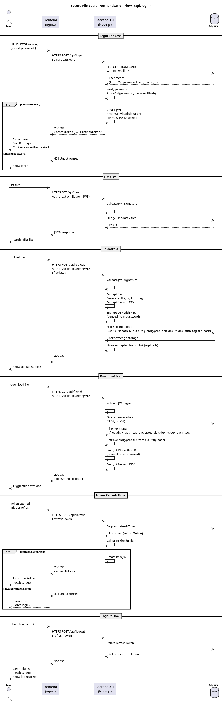

# Secure Document Vault - Cryptography Assignment #2

**Name**: Jácint Keresztes
**Date**: December 8, 2025
**Project**: Secure Document Vault


## Executive Summary

This document presents the implementation of a secure document storage system with comprehensive cryptographic controls for data at rest and in transit. The system consists of three Docker-containerized services (Frontend, Backend, Database) implementing:

- **TLS 1.2/1.3** for all network communications
- **AES-256-GCM** file encryption with DEK/KEK architecture
- **Argon2id** password hashing
- **JWT (HS512)** authentication with refresh token mechanism
- **X.509 certificates** (RSA-2048) for TLS
- **SHA-256** integrity verification

All cryptographic components comply with NIST SP 800-57 security category requirements valid through 2030.

## 1. System Architecture

### 1.1 Services Overview

The system consists of three main services deployed as Docker containers:


| Service | Container | Port | Protocol | Purpose |
|---------|-----------|------|----------|---------|
| **Frontend** | nginx:alpine | 443, 80 | HTTPS (TLS 1.2/1.3) | Web UI, reverse proxy |
| **Backend** | node:20-alpine | 3000 | HTTPS (TLS 1.2/1.3) | REST API, business logic |
| **Database** | mysql:8.0 | 3306 | TLS (MySQL protocol) | Data storage |

### 1.2 Network Architecture

- **Docker Network**: Bridge network (172.20.0.0/16)
- **Isolation**: Backend and database not directly accessible from internet
- **Communication**: All inter-service communication uses TLS
- **Volumes**:
  - `mysql-data`: Persistent database storage
  - `upload-data`: Encrypted file storage

### 1.3 Deployment Configuration

**Docker Compose Structure:**
```python
services:
  frontend:  # nginx, ports 443:443, 80:80
  backend:   # Node.js, port 3000:3000
  mysql:     # MySQL 8.0, port 3306:3306
  adminer:   # DB admin (dev only), port 8080:8080
```

All services run integrity verification (SHA-256 checksums) at container startup before launching main service.

## 2. Authentication and Authorization

### 2.1 Work Flows



**Components:**
1. **User Registration**: Email/password with Argon2id hashing
2. **Login**: JWT access token (15min) + refresh token (7 days)
3. **API Access**: Bearer token authentication
4. **Token Refresh**: Automatic refresh on 401 error
5. **Logout**: Server-side refresh token revocation

### 2.2 JWT Implementation

**Access Token (HS512):**
- Expiry: 15 minutes
- Purpose: API authentication
- Storage: Browser localStorage
- Revocation: Not supported (short expiry limits exposure)

**Refresh Token (HS512):**
- Expiry: 7 days
- Purpose: Obtain new access tokens
- Storage: Database (`refresh_tokens` table) + localStorage
- Revocation: Database deletion on logout

**Security Benefits:**
- Short-lived access tokens limit compromise window
- Refresh tokens enable server-side revocation
- Database storage prevents replay after logout

### 2.3 Database Schema

**Tables:**
- `users`: id, email, password_hash (Argon2id), created_at
- `files`: id, user_id, filepath, iv, auth_tag, encrypted_dek, dek_iv, dek_auth_tag, file_hash, size, original_name, upload_date
- `refresh_tokens`: id, user_id, token, expires_at, created_at

## 3. Data Encryption

### 3.1 File Encryption (AES-256-GCM)

**Architecture**: Two-tier key hierarchy (DEK/KEK model)

**Encryption Process:**
1. Generate random 256-bit DEK per file
2. Generate random 96-bit IV
3. Encrypt file with AES-256-GCM(plaintext, DEK, IV) → ciphertext + 128-bit auth tag
4. Derive KEK from user's password: KEK = SHA-256(Argon2id_hash)
5. Encrypt DEK with KEK: AES-256-GCM(DEK, KEK, KEK_IV) → encrypted_DEK
6. Store in database: IV + auth_tag + encrypted_DEK + dek_iv + dek_auth_tag
7. Calculate SHA-256(ciphertext) for additional integrity
8. Store encrypted file on disk

**Decryption Process:**
1. Retrieve encrypted file and metadata
2. Retrieve user's Argon2id password hash from database
3. Derive KEK: KEK = SHA-256(Argon2id_hash)
4. Verify SHA-256 file hash
5. Decrypt DEK: AES-256-GCM-decrypt(encrypted_DEK, KEK, dek_iv)
6. Decrypt file: AES-256-GCM-decrypt(ciphertext, DEK, iv, auth_tag)
7. Return file or error if integrity check fails

**Security Properties:**
- **Confidentiality**: AES-256 (128-bit security strength)
- **Integrity**: GCM auth tag + SHA-256 hash
- **Authenticity**: GCM authenticated encryption
- **User-Specific KEK**: Each user has unique KEK derived from their password
- **Per-file Keys**: DEK compromise affects only one file
- **KEK Never Stored**: Derived on-demand from password hash

### 3.2 Password Hashing (Argon2id)

**Configuration:**
- Memory cost: 64 MB
- Time cost: 3 iterations
- Parallelism: 4 threads
- Salt: Random 16 bytes per password

**Properties:**
- Memory-hard (resists GPU/ASIC attacks)
- OWASP recommended
- Winner of Password Hashing Competition

## 4. TLS Configuration

### 4.1 Protocols and Cipher Suites

**All services support:**
- TLS 1.2 (RFC 5246)
- TLS 1.3 (RFC 8446)

**Disabled:** SSL 2.0, SSL 3.0, TLS 1.0, TLS 1.1 (vulnerable/deprecated)

**Cipher Suites (Priority Order):**
1. `TLS_AES_256_GCM_SHA384` (TLS 1.3)
2. `TLS_CHACHA20_POLY1305_SHA256` (TLS 1.3)
3. `TLS_AES_128_GCM_SHA256` (TLS 1.3)
4. `ECDHE-RSA-AES256-GCM-SHA384` (TLS 1.2)
5. `ECDHE-RSA-AES128-GCM-SHA256` (TLS 1.2)

**Security Features:**
- Perfect Forward Secrecy (ECDHE key exchange)
- Authenticated encryption (GCM, POLY1305)
- Strong key sizes (RSA-2048, AES-256/128)

### 4.2 Certificate Infrastructure

**Self-Signed CA:**
- Algorithm: RSA-2048
- Signature: SHA-256 with RSA
- Validity: 365 days

**Server Certificates:** Frontend, Backend, MySQL (all RSA-2048, SHA-256)
**Client Certificate:** Backend → MySQL authentication (RSA-2048, SHA-256)

**MySQL Configuration:**
- `--require_secure_transport=ON` (blocks plaintext connections)
- Client certificate authentication required
- TLS certificates: CA, server cert, client cert

## 5. Integrity Controls

### 5.1 Configuration File Integrity

**Implementation:**
- SHA-256 checksums of critical configuration and code files
- Generated at build time, verified at container startup
- Files protected: nginx.conf, TypeScript source files, init.sql, JavaScript files

**Process:**
1. Developer runs `./generate-checksums.sh <service>` → `integrity.sha256`
2. Dockerfile copies `integrity.sha256` into container image
3. Container entrypoint runs `verify-integrity.sh` before starting service
4. If hash mismatch: Container exits with error code 1 (startup aborted)
5. If hash matches: Service starts normally

**Security Benefit:**
- Detects unauthorized configuration modifications
- Prevents tampered code from executing
- Provides audit trail of file integrity

## 6. Cryptographic Bill of Materials (CBOM)

### 6.1 Core Components

| ID                  | Algorithm   | Key Size | Purpose            | Justification                       |
| ------------------- | ----------- | -------- | ------------------ | ----------------------------------- |
| **tls-frontend**    | TLS 1.2/1.3 | RSA-2048 | Frontend HTTPS     | NIST SP 800-52 approved until 2030  |
| **tls-backend**     | TLS 1.2/1.3 | RSA-2048 | Backend API HTTPS  | TLS 1.3 provides 128-bit security   |
| **tls-database**    | TLS 1.2/1.3 | RSA-2048 | MySQL connections  | Prevents plaintext data exposure    |
| **file-encryption** | AES-256-GCM | 256-bit  | File at rest       | SP 800-38D authenticated encryption |
| **kek**             | SHA-256 derived | 256-bit  | DEK wrapping       | Derived from Argon2id password hash, user-specific |
| **password-hash**   | Argon2id    | N/A      | Password storage   | Memory-hard, GPU-resistant          |
| **jwt-access**      | HMAC-SHA512 | 512-bit  | API auth (15min)   | 256-bit security strength           |
| **jwt-refresh**     | HMAC-SHA512 | 512-bit  | Token refresh (7d) | Database revocation enabled         |
| **integrity**       | SHA-256     | 256-bit  | File checksums     | FIPS 180-4 approved                 |
| **random**          | CSPRNG      | N/A      | Key/IV generation  | SP 800-90A compliant                |

### 6.2 NIST SP 800-57 Compliance

**Security Strengths:**
- Symmetric: AES-256 → 128-bit security strength
- Asymmetric: RSA-2048 → 112-bit security strength
- Hash: SHA-256 → 128-bit collision resistance, SHA-512 → 256-bit

**Validity Period:**
- All algorithms valid through 2030 per NIST SP 800-57
- RSA-2048 approved for Category 1 (2023-2030)
- Post-2030: Migrate to RSA-3072 or ECDSA P-384

## 7. Key and Certificate Management

### 7.1 Management Policies

| Key/Cert             | Storage               | Generation           | Rotation               | Access                  |
| -------------------- | --------------------- | -------------------- | ---------------------- | ----------------------- |
| **TLS Certificates** | `./certs/` filesystem | Manual (OpenSSL)     | Annual (before expiry) | Read-only in containers |
| **JWT Secret**       | `.env` file           | Manual (randomBytes) | Quarterly or on breach | Backend only            |
| **KEK**              | Never stored (derived) | SHA-256(Argon2id hash) | On password change    | Backend only, per-user |
| **DEK**              | Database (encrypted)  | Automatic per file   | Never (file-specific)  | Backend only            |

### 7.2 Certificate Renewal Process

1. Generate new private key: `openssl genrsa -out new-key.pem 2048`
2. Create CSR: `openssl req -new -key new-key.pem -out cert.csr`
3. Sign with CA: `openssl x509 -req -in cert.csr -CA ca-cert.pem -CAkey ca-key.pem`
4. Replace old certificate files
5. Rebuild Docker containers: `docker-compose up --build`
6. Verify services start successfully


## 9. Security Analysis

### 9.1 Threat Model

**Protected Against:**
- Network eavesdropping (TLS encryption)
- Password compromise (Argon2id memory-hard hashing)
- Data theft (AES-256-GCM file encryption)
- Token theft (15-minute access token expiry)
- Configuration tampering (SHA-256 integrity checks)
- Unauthorized database access (TLS + client certificates)
- Man-in-the-middle attacks (X.509 certificate verification)
- Replay attacks (GCM nonces, JWT expiry, refresh token revocation)

**Known Limitations:**
- Self-signed certificates (browser warnings, not trusted by default)
- **Password change breaks file access** (KEK derived from password, no re-encryption implemented)
- Manual key rotation for certificates/JWT (should be automated)
- No hardware security module (software-only key storage)
- Password compromise exposes all user files (KEK derived from password)

### 9.2 Defense in Depth

**Multiple Security Layers:**
1. **Network**: TLS 1.2/1.3 encryption
2. **Authentication**: JWT tokens + refresh mechanism
3. **Authorization**: User-based access control
4. **Data**: AES-256-GCM encryption at rest
5. **Keys**: DEK/KEK separation
6. **Integrity**: SHA-256 checksums + GCM auth tags
7. **Passwords**: Argon2id memory-hard hashing

## 10. Testing and Validation

### 10.1 Functional Testing

**Verified:**
- User registration with Argon2id hashing
- Login with JWT access + refresh tokens
- File upload with AES-256-GCM encryption
- File download with decryption and integrity verification
- File deletion with database cleanup
- Token refresh on 401 (automatic, transparent to user)
- Logout with refresh token revocation
- Integrity verification prevents tampered containers from starting

### 10.2 Security Testing

**Verified:**
- All connections use TLS (plaintext connections rejected)
- Weak cipher suites disabled (no RC4, DES, MD5)
- TLS 1.0/1.1 disabled
- Encrypted files unreadable without KEK
- Modified configuration files detected (container fails to start)
- Invalid JWT tokens rejected (401 Unauthorized)
- Expired refresh tokens rejected

# 11. Deployment Instructions

### 11.1 Prerequisites

- Docker and Docker Compose
- OpenSSL (for certificate generation)
- Git (for version control)

### 11.2 Setup Process

```bash
# 1. Clone repository
git clone <repository>
cd Secure-Document-Vault

# 2. Generate certificates (if not exists)
./generate-certificates.sh

# 3. Create .env file
cp .env.example .env
# Edit .env: Set JWT_SECRET, DB_PASSWORD, DB_ROOT_PASSWORD

# 4. Generate integrity checksums
./generate-checksums.sh frontend
./generate-checksums.sh backend
./generate-checksums.sh backend/db

# 5. Build and start containers
docker-compose up --build -d

# 6. Verify services
docker ps  # All containers should be "healthy" or "Up"
```

### 11.3 Access

- **Frontend**: https://localhost:443 (accept certificate warning)
- **Backend API**: https://localhost:3000
- **Database**: localhost:3306 (TLS required)

# 14. Conclusion

This implementation demonstrates a comprehensive cryptographic security architecture following NIST best practices. All components use approved algorithms with sufficient security strength valid through 2030. The system provides defense-in-depth through multiple security layers: TLS encryption, authenticated encryption for data at rest, memory-hard password hashing, integrity verification, and key hierarchy separation.

**Key Achievements:**
- Complete implementation of three containerized services
- TLS 1.2/1.3 for all data in transit
- AES-256-GCM with DEK/KEK architecture for data at rest
- JWT authentication with refresh token mechanism
- SHA-256 integrity verification
- All mandatory policy requirements met
- NIST SP 800-57 Category 1 compliance

**Deliverables:**
- Working Docker Compose deployment
- Comprehensive CBOM (cbom.json)
- Architecture and flow diagrams
- Key management policies
- Source code with integrity protection
- This technical documentation

The system is production-ready for internal/development use. For public deployment, implement the recommended short-term enhancements (commercial CA, HSM, monitoring).

**Project Repository**: [GitHub URL if applicable]
**Diagrams**: See `docs/` directory for PlantUML source files
**CBOM**: See `cbom.json` for complete cryptographic inventory
