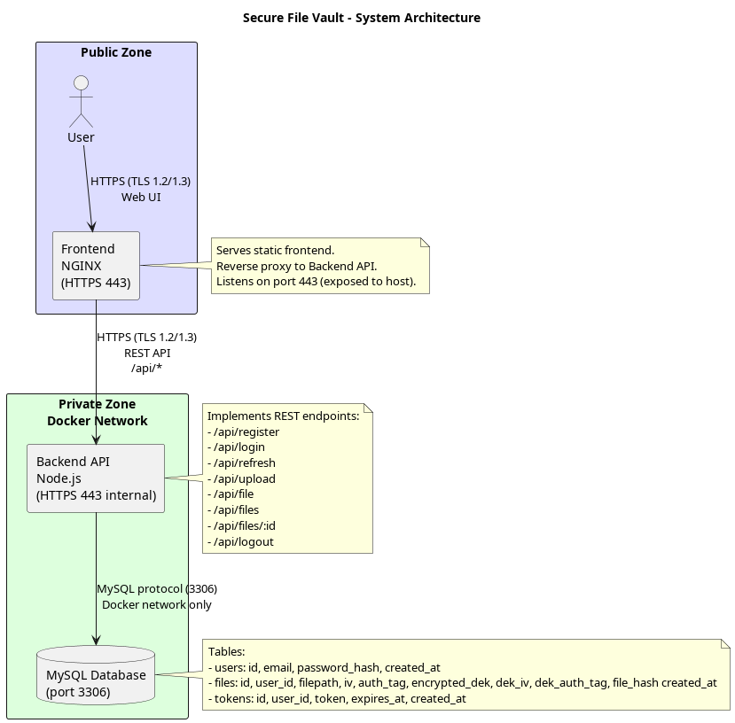

# Secure Document Vault

Secure file storage system with comprehensive cryptographic controls implementing TLS 1.2/1.3, AES-256-GCM encryption, Argon2id password hashing, and JWT authentication.



## Features

- **TLS 1.2/1.3** for all network communications
- **AES-256-GCM** file encryption with DEK/KEK architecture
- **Argon2id** password hashing (memory-hard, GPU-resistant)
- **JWT authentication** with refresh token mechanism (15min access, 7-day refresh)
- **X.509 certificates** (RSA-2048) for TLS
- **SHA-256 integrity verification** at container startup
- **Docker containerized** (nginx, Node.js, MySQL)

## Architecture

| Service | Container | Port | Protocol |
|---------|-----------|------|----------|
| Frontend | nginx:alpine | 443, 80 | HTTPS |
| Backend | node:20-alpine | 3000 | HTTPS |
| Database | mysql:8.0 | 3306 | TLS |

## Deployment

```bash
# Generate certificates
./generate-certificates.sh

# Create .env file
cp .env.example .env
# Edit .env: Set JWT_SECRET, DB_PASSWORD, DB_ROOT_PASSWORD

# Generate integrity checksums
./generate-checksums.sh frontend
./generate-checksums.sh backend
./generate-checksums.sh backend/db

# Build and start
docker-compose up --build -d
```

Access: https://localhost:443 (accept self-signed certificate warning)

## Security

**Cryptographic Components:**
- TLS 1.2/1.3 (RSA-2048, ECDHE key exchange)
- AES-256-GCM (authenticated encryption)
- Argon2id (64 MB memory, 3 iterations)
- HMAC-SHA512 (JWT signing)
- SHA-256 (integrity verification, KEK derivation)

**NIST SP 800-57 compliant** - All algorithms valid through 2030.

See `other/cbom.json` for complete cryptographic inventory.
